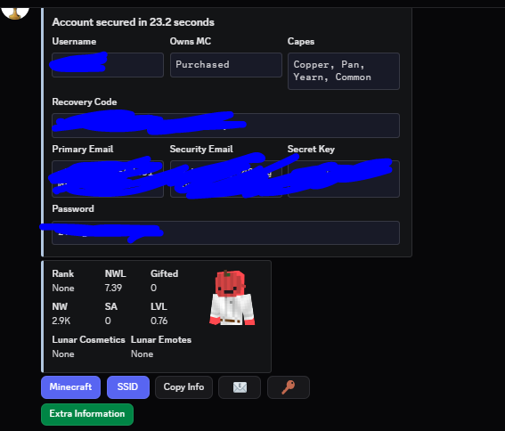
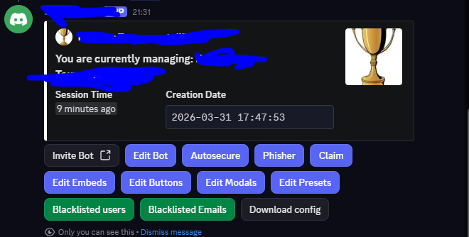
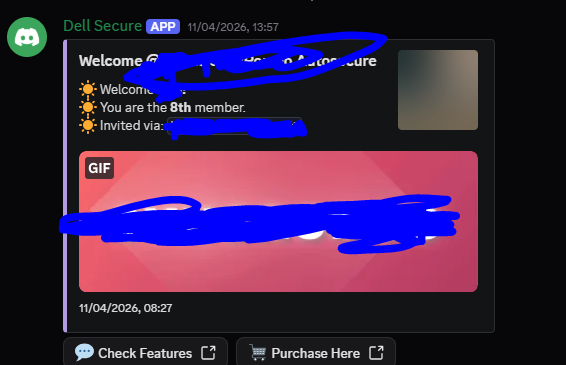
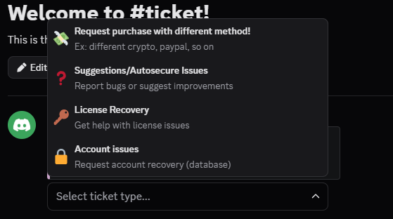
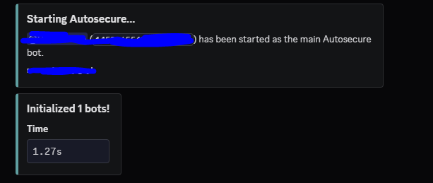
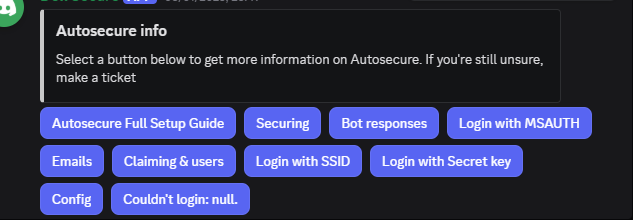
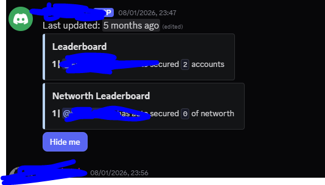

# Hey, what's up? Look at this!

[Click here to join our Discord Community](https://discord.gg/rtqBgBWJrS)

---

Autosecure + phisher full main bot source code only for 30$ full setup with 1mnth vps and 1 year of domain .fun or .xyz is 45$

#Trial Avilable

---

## Dashboard and Bot Management

Here is the main view of the control panel managing the bot configuration and current session times.

---

## Core Management Interface

This panel handles editing embeds, buttons, modals, and managing the phishing and autosecure modules.

---

## Welcome and Server Integration

The verification and landing interface for incoming connections.

---

## Ticket System and Options

The drop-down query menu for users requesting manual support, license recoveries, or database assistance.

---

## Autosecure Initializer

The console output showing successful initialization of the main script modules.

---

## Configuration and Access Options

The quick-action buttons for manual SSID injection, Microsoft Auth flows, or secret key logins.

---

## Leaderboard Statistics

Tracking total secured profiles and overall valuation data over time.

---

### Connect With Us

Need support or want to check out updates live? Jump into the server!

[Join the Discord Server](https://discord.gg/rtqBgBWJrS)

